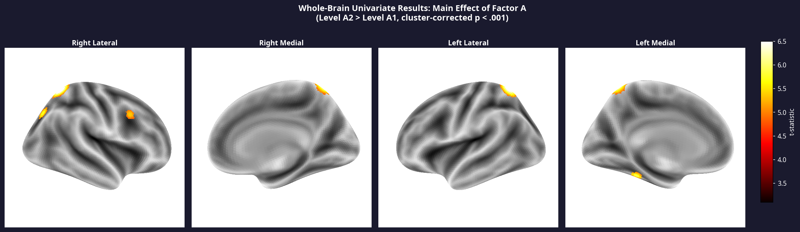
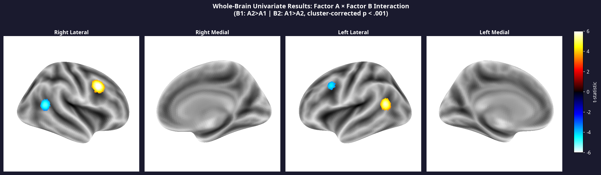
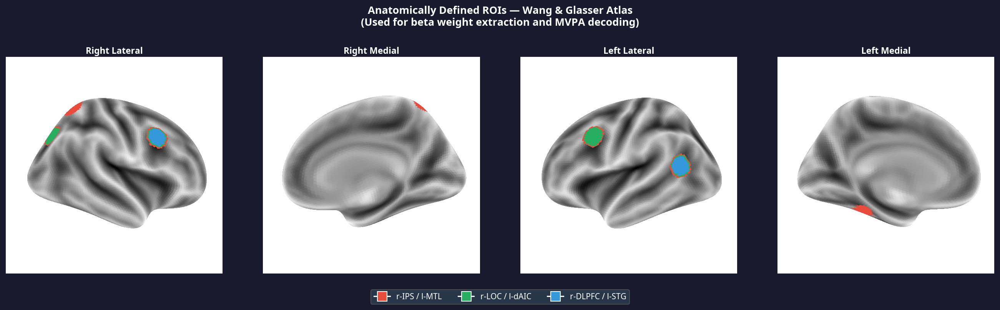
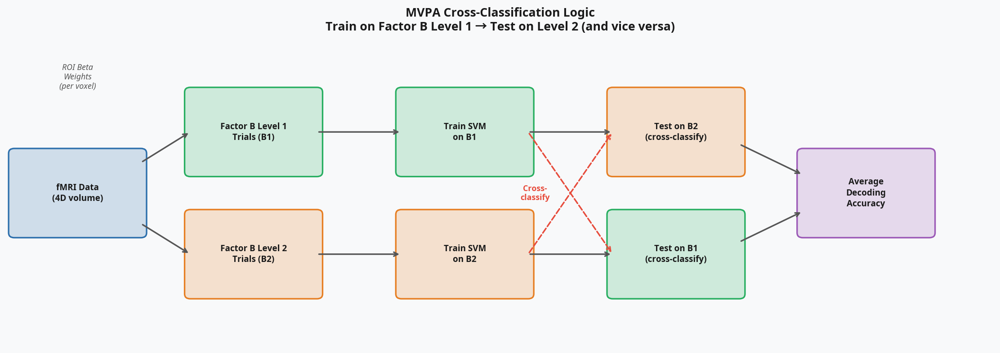
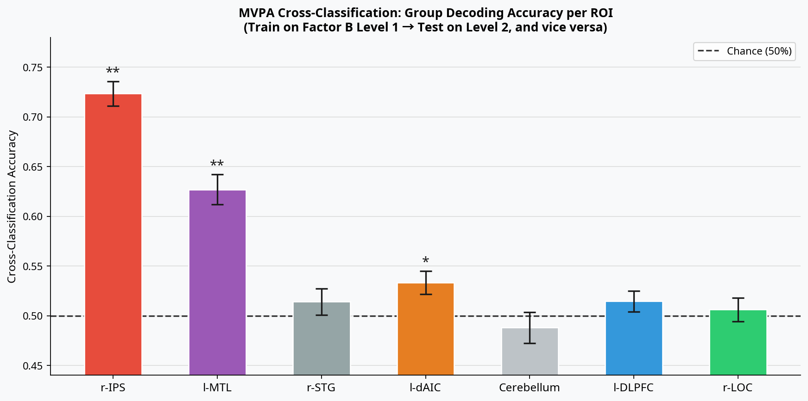
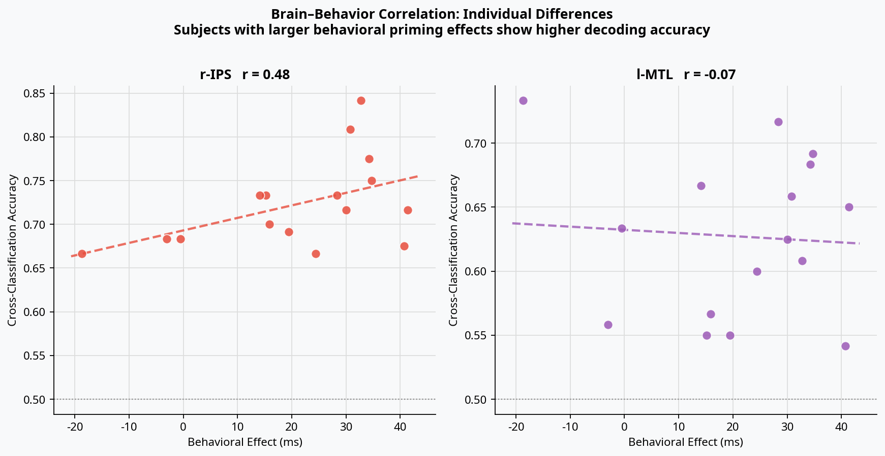

# fMRI Preprocessing, GLM & MVPA Pipeline (2×2 Design)

[](#)
[](#)
[](#)
[](LICENSE)
[-orange.svg)](https://pubmed.ncbi.nlm.nih.gov/38165741/)

This is a guide to running preprocessing and analysis of fMRI data. Originally developed for a peer-reviewed study on action selection (O'Bryan et al., 2024), this repository contains a complete, end-to-end neuroimaging analysis pipeline designed for **2×2 factorial fMRI experiments**. 

The scripts use MATLAB, AFNI, SUMA, and Freesurfer, and the pipeline is fully adaptable to any fMRI study requiring:
1. **Surface-based preprocessing** (Freesurfer + AFNI SUMA)
2. **Whole-brain univariate GLM analysis** (Single-subject & Group ANOVA)
3. **Region-of-Interest (ROI) extraction** using Wang & Glasser atlases
4. **Machine Learning / MVPA Cross-Classification** (Support Vector Machines)

---

## Interactive Demo (No fMRI Data Required)

A fully self-contained Python demo is included in the `demo/` folder — no fMRI data required. It uses synthetic dummy data that mirrors the real pipeline output format, demonstrating the exact outputs produced at each stage, including brain surface activations and a real SVM cross-classification analysis.

**To run the demo locally:**
```bash
git clone https://github.com/mcdan909/fMRI_Processing_Analysis.git
cd fMRI_Processing_Analysis
pip install numpy pandas matplotlib scikit-learn nilearn nibabel scipy
python demo/run_demo.py        # behavioral + GLM outputs
python demo/gen_brain_surface.py  # brain surface figures
python demo/gen_mvpa.py        # MVPA pipeline
```

---

## Example Outputs (Generated from Demo)

### Whole-Brain Univariate Analysis

The pipeline maps fMRI data to the cortical surface (Freesurfer fsaverage) to identify regions responding to main effects and interactions. All results are cluster-corrected at **p < .001**.

**Main Effect (Factor A):**


**Interaction (Factor A × Factor B):**


**Anatomically Defined ROIs (Wang & Glasser Atlas):**


### Multi-Voxel Pattern Analysis (MVPA)

Instead of just looking at average activation, the pipeline uses **machine learning** to decode information from distributed voxel patterns.



By training a Support Vector Machine (SVM) on one context (Factor B Level 1) and testing it on a different context (Factor B Level 2), we can demonstrate that a brain region contains a generalized, context-independent representation of Factor A — a method known as **cross-classification**.



### Individual Differences (Brain–Behavior Correlation)

The pipeline correlates neural decoding accuracy with behavioral metrics (e.g., reaction time differences) to link brain representations directly to human performance.



---

## Setup & Installation Resources

Before running the pipeline, you will need AFNI, SUMA, Freesurfer, and MATLAB. 

**Installation Guides:**
- **Set up AFNI & SUMA on Mac:** [gist.github.com/paulgribble/7291469](https://gist.github.com/paulgribble/7291469)
- **Set up AFNI & SUMA on Ubuntu:** [neuro.debian.net/pkgs/afni.html](http://neuro.debian.net/pkgs/afni.html)
- **Download Freesurfer:** [freesurfer.net/fswiki/DownloadAndInstall](http://freesurfer.net/fswiki/DownloadAndInstall)

**Video Tutorials:**
Very nice video tutorials can also be found on Andrew Jahn's YouTube page: [AFNI Tutorial Playlist](https://www.youtube.com/playlist?list=PLIQIswOrUH6-v5EWwFdMsTZttt4407KW9). He walks through processing a single subject and getting started with AFNI. This tutorial has many differences because he processes data with `afni_proc.py`; however, I've modified some of the steps in these scripts and have had cleaner and more robust results.

### Prologue: A Quick Note on Shell Scripts for Beginners

These scripts use the C shell derivative (`tcsh`). The following line must be the first line in any script: `#!/bin/tcsh -xef`

To execute a script, open a terminal, `cd` to the folder containing the script, then type `tcsh`, then the script name (e.g., `tcsh DICOMto3dStep1.sh`). Note that once a variable is defined (`set $variableName = name`), it is referenced using the `$` sign; however, in some cases, brackets will also need to bound variables (e.g., `${variableName}`) for proper separation. The `\` sign after a line of code tells the script to advance to the next line within a particular command. Without it the script will stop and fail!

**Modifying your bash profile:**
Before starting, type `nano ~/.bash_profile` into the terminal (`nano ~/.bashrc` for Linux). You want to add AFNI, Freesurfer, and Python binaries to your path so they can be called in the scripts. Mine looks as follows, but this may be different depending on your machine:

```bash
PATH="/usr/bin:/bin:/usr/sbin:/sbin:/usr/local/bin:$PATH"
export PATH=<YOUR_SCRIPTS_DIR>:$PATH
export PATH=~/abin:$PATH
export PATH=/usr/lib/afni:$PATH
export PATH=/usr/lib/afni/bin:$PATH
export PATH=/usr/share/afni/atlases/:$PATH
export PATH=/home/jdmccart/Documents/suma_MNI_N27/:$PATH
export DYLD_FALLBACK_LIBRARY_PATH=/usr/lib/afni
export PYTHONPATH=/usr/local/lib/python2.7/site-packages
export FREESURFER_HOME=/usr/local/freesurfer
source $FREESURFER_HOME/SetUpFreeSurfer.sh
export SUBJECTS_DIR=/usr/local/freesurfer/subjects
```

**Viewing Data:**
To view data in AFNI, simply `cd` to the folder containing the files and type `afni` in the terminal. To view AFNI & SUMA data together, type:
```bash
afni -niml & suma -spec $SubjectSumaFolder/$subj_$hemi.spec -sv $SubjectSumaFolder/$subj_$surfVol
```

---

## PART I. PREPROCESSING

### Step 1. Convert DICOMs to NIFTI and/or BRIK (`DICOMto3dStep1.sh`)

Move the DICOM folders to your subject directory. Run `mcverter` on all files (more info and download: [lcni.uoregon.edu/downloads/mriconvert](https://lcni.uoregon.edu/downloads/mriconvert/mriconvert-and-mcverter)). Other programs do the same thing (e.g., `dcm2nii`), but I prefer `mcverter` because it outputs a text file with the scanning parameters (great when it comes time to write your methods section).

```bash
# Set your data directory at the top of the script
set dataDir = "<YOUR_DATA_DIR>"
tcsh Preprocessing/DICOMto3dStep1.sh
```

### Step 2. Make Individual Surfaces (`SurfaceReconAllStep2.sh`)

Runs Freesurfer's `recon-all`. **This takes around 6 hrs per subject;** I recommend setting it up to run over the weekend and not doing it serially.

```bash
tcsh Preprocessing/SurfaceReconAllStep2.sh
```

### Step 3. Make a SUMA Folder for Surfaces (`MakeSpecFileStep3.sh`)

Convert into something AFNI/SUMA can read. Check that the alignment is excellent:
```bash
afni -niml & suma -spec $subjectID_lh.spec -sv $subjectID_SurfVol+orig &
```
When SUMA and AFNI are open, press 't' in the SUMA window to make it talk to AFNI. This will bring up boundaries in AFNI corresponding to the surface. 

### Step 4. Strip the Skull (`SkullStripHiResStep4.sh`)

If alignment looks good, run this to create a skull stripped version of the surface volume. It may look like some of the cortex is removed in comparison to the SUMA volume, but that’s why we created surfaces! A surface-based analysis will include all the voxels on the SUMA surface that may be excluded by AFNI.

### Step 5. Preprocess Functional Data (`preprocessFunctStep5.sh`)

This de-obliques the functional data, optionally de-spikes the data, does time-slice correction, and performs motion correction (volume registration).

Check the motion parameters plot. There’s some discrepancy as to when a subject should be rejected, but I’ve seen 2x voxel-size as a standard (4 mm for the new scanner at Brown). The outcount plots will show you time points that contain outliers. A breakdown of outlying timepoints is found in `$subj.allruns.outlierTRs.txt`.

### Step 6. Preprocess Anatomical and Align (`preprocessAnatStep6.sh`)

Aligns the anatomical volume to the functional space. `cd` to the subject's EPI folder and run AFNI to check the alignment between the EPI and anatomical images.

### Step 7. Prep Data for GLM (`prepGLMStep7.sh`)

Perform smoothing and normalization so data can be expressed in terms of % signal change instead of beta weights. For smoothing in `3dmerge` it is common to set this value to at least 2x your voxel size (many papers use 6-8 mm smoothing kernels).

### Step 8. Make Stim Timing Files (`GetStimTimesStep8.m`)

This is done in MATLAB. This generates local stim times to be used in the GLM based on sorting each condition in the behavioral data files.

---

## PART II. SINGLE SUBJECT ANALYSIS

### Step 1. Run the GLM

There are options for both volume- (`volGLM`) and surface-based (`surfGLM`) GLMs. Make sure to indicate which runs will be used for the GLM with the `-input` option. Change the `-CENSORTR` option to eliminate the TRs at the beginning of the run you used as your baseline period.

This script is currently set up for a 2x2 design with an event-related design, indicated by the `GAM` option. Define the general linear tests you'd like to perform with the `-gltsym` option. E.g., `-gltsym 'SYM: 2*EyeColorSwitch -HandColorRepeat -HandColorSwitch'`

---

## PART III. GROUP WHOLE-BRAIN ANALYSIS

### Step 1. Run the ANOVA for the Whole-Brain GLM

Run the `volGroupANOVA` or `surfGroupANOVA` script. Read the script for an explanation of how to set up the ANOVA for your experiment. N.B. For the whole brain analysis, use the blurred dataset (`blur8`).

### Step 2. Run a Monte Carlo Simulation

Run the `3dClusterSimulation` script to determine the voxel cluster size that would be unlikely to occur due to chance for the number of voxels in your ANOVA mask at your level of spatial smoothing (`-fwhm` option).

Using this table, you can use the 'clusterize' option in AFNI when viewing the ANOVA output and set the appropriate cluster size for a given p-value. After this correction, the whole-brain map will reflect 'real' significant clusters. At this point, you have whole-brain group data!

---

## PART IV. SINGLE SUBJECT ROI DEFINITION

Regions of interest (ROIs) can be defined either functionally or anatomically. This tutorial covers anatomical definition using Freesurfer parcellation methods, allowing for maps of visual topography (Wang et al. 2015) and a multi-modal map of 180 ROIs per hemisphere (Glasser et al. 2016).

### Step 1. Install Scripts and Atlases

A set of Python scripts created by my good friend Peter Kohler will make this process a breeze. Download them here: [github.com/pjkohler/MRI](https://github.com/pjkohler/MRI). Add the folder to your bash profile path.

The atlases can be found here:
- **Wang et al (2015):** [princeton.edu/~napl/vtpm.htm](http://www.princeton.edu/~napl/vtpm.htm)
- **Glasser et al (2016):** [balsa.wustl.edu/study/show/RVVG](https://balsa.wustl.edu/study/show/RVVG)

### Step 2. Generate ROIs (`wangGlasserROIs.sh`)

This takes ~45 mins per subject and generates `wang_atlas` and `glasser_atlas` folders in the subject's Freesurfer folder.

To view an atlas in SUMA:
```bash
suma -spec $SUBJECTS_DIR/$subj/SUMA/$subj_$hemi.spec -sv $SUBJECTS_DIR/$subj/SUMA/$subj_NoSkull.SurfVol+orig
```
In SUMA, go to **View > Object Controller** > **Load Dset** and load the appropriate hemispheric atlas. Change the colorbar to **FreeSurfer** to distinguish ROIs. The labels for the Glasser atlas can be found on pgs. 81-85 of the article's supplementary material.

### Step 3. Extract Beta Weights (`getBetaWeightsWangSurf.sh`)

> **N.B.** When extracting beta weights, remember to use the unblurred GLM dataset (`blur0`).

### Step 4. Threshold Voxels

It is wise to threshold which voxels you include in the mean based on the critical F-value. Eklund et al. (2016) offers deep insights into FDRs in fMRI: [doi.org/10.1073/pnas.1602413113](https://doi.org/10.1073/pnas.1602413113). It's a trade-off because too high of a threshold will result in no significant voxels being extracted, but you run the risk of true activations > noise.

### Step 5. Plot Group Results (`plotBetaWeightROIs.m`)

Run this in MATLAB. This will generate bar graphs with standard error for your conditions and indicate significant effects. You now have results for your ROIs of interest!

---

## Citation

If you use this pipeline or the original study design in your work, please cite:

> O'Bryan, S. R., McCarthy, J. D., & Song, J. H. (2024). Effector-independent neural representations of selection history during action preparation. *Journal of Cognitive Neuroscience, 36*(4), 698–713. https://doi.org/10.1162/jocn_a_02102

See also [`CITATION.cff`](CITATION.cff) for a machine-readable citation file. GitHub will display a **"Cite this repository"** button automatically.
